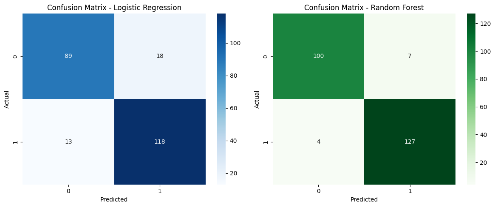

# ❤️ Heart Disease Prediction Using Machine Learning

This project uses patient health data to predict the likelihood of heart disease using various Machine Learning models. The goal is to build an intelligent system that assists in early detection of heart disease, helping healthcare professionals and patients make timely decisions.

---

## 📌 Problem Statement

Heart disease is one of the leading causes of death globally. Early prediction can save lives by prompting quicker intervention. This project builds a classifier that predicts whether a person has heart disease based on medical attributes like chest pain type, cholesterol level, fasting blood sugar, ECG results, and more.

---

## 🧠 Dataset Overview

The dataset contains patient records with 13 medical attributes and a binary target variable:

| Sr. No. | Feature Name              | Description                                                                 |
|---------|--------------------------|-----------------------------------------------------------------------------|
|1.| `age`                    | Age of the patient (in years)                                               |
|2.| `sex`                    | Gender (0 = female, 1 = male)                                               |
|3.| `cp`                     | Chest pain type (1 to 4)                                                    |
|4.| `trestbps`               | Resting blood pressure (in mmHg)                                            |
|5.| `chol`                   | Serum cholesterol (mg/dl)                                                   |
|6.| `fbs`                    | Fasting blood sugar > 120 mg/dl (1 = true, 0 = false)                       |
|7.| `restecg`                | Resting electrocardiographic results (0 to 2)                               |
|8.| `thalach`                | Maximum heart rate achieved                                                 |
|9.| `exang`                  | Exercise induced angina (1 = yes, 0 = no)                                   |
|10.| `oldpeak`                | ST depression induced by exercise                                           |
|11.| `slope`                  | Slope of the peak exercise ST segment (1 to 3)                              |
|12.| `target`                 | Heart Disease (0 = No, 1 = Yes)                                             |

---

## 🛠 Libraries Used

- `numpy`
- `pandas`
- `matplotlib`
- `seaborn`
- `scikit-learn`

---

## ⚙️ Workflow

### 1. Data Preprocessing
- Loaded dataset and checked for null values
- Encoded categorical features (`cp`, `restecg`, `slope`) using **one-hot encoding**
- Split data into features (`X`) and target (`y`)
- Train-test split: 80% training, 20% testing

### 2. Model Building
- Trained and tested:
  - **Logistic Regression**
  - **Random Forest Classifier**

### 3. Model Evaluation
- Calculated **Accuracy**, **Confusion Matrix**, and **Classification Report**
- Visualized performance using:
  - **Confusion Matrix Heatmaps**
  - **Bar plot comparing accuracy of both models**

---

## 📈 Results

| Model               | Accuracy |
|--------------------|----------|
| Logistic Regression| 86%      |
| Random Forest       | **95%**  |

✅ Random Forest performed better on this dataset and was selected as the final model.

---

## 📊 Confusion Matrix Example

---

## 🔍 Insights

- Random Forest handled feature interactions and non-linearity better
- Logistic Regression performed well but slightly underfit the complexity
- One-hot encoding helped the models interpret categorical data better

---

## 💾 How to Run

1. Clone the repository
2. Install dependencies: `pip install -r requirements.txt`
3. Run the notebook in Jupyter / Anaconda
4. Test and modify as needed

---

## 📌 Future Work

- Add more models (XGBoost, SVM)
- Use cross-validation for stability
- Deploy using Streamlit or Flask

---

## 🙋‍♂️ Author

👨‍💻 **Shivanshu Shukla**  
BTech | AI & ML Enthusiast  
GitHub: [@shivanshu-1609](https://github.com/shivanshu-1609)

---

## 🌐 Connect

If you liked the project, leave a ⭐ on the repo!  
Feel free to connect with me on [LinkedIn](https://linkedin.com/in/shivanshu-shukla16/) for feedback, collaborations, or queries.

---

